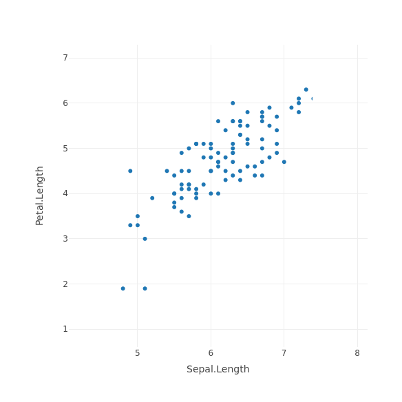
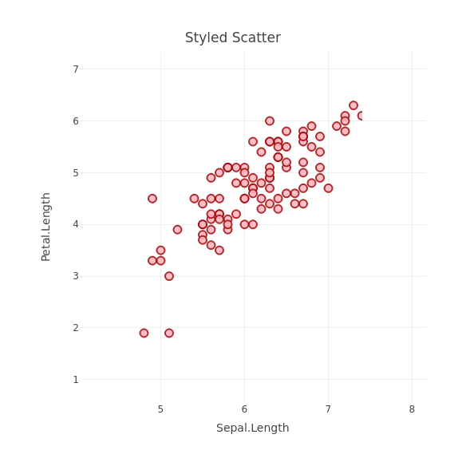

Week3 Plotly Presentation Home work 
========================================================
author: Ping Hu
date: 01-07-2019
autosize: true

Requirement for Home Work
========================================================

For more details on authoring R presentations please visit <https://support.rstudio.com/hc/en-us/articles/200486468>.

- have data and name
- is a presentation
- interactive, created by plotly

Scattered Plot
========================================================


```r
library(plotly)
plot_ly(data = iris, x = ~Sepal.Length, y = ~Petal.Length, type="scatter")
```



styled scattered plot
========================================================


